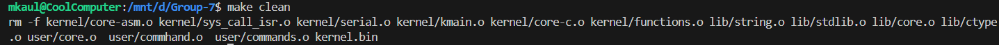
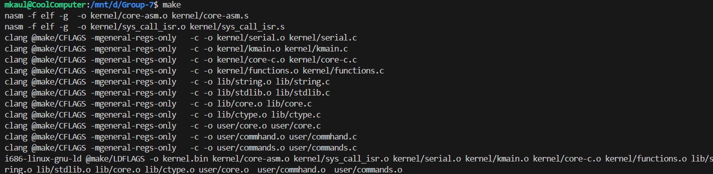
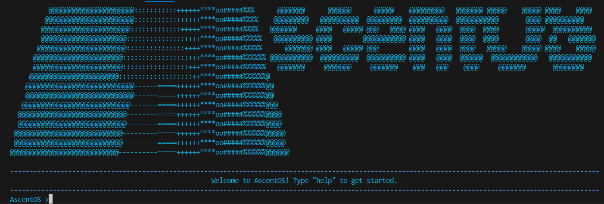
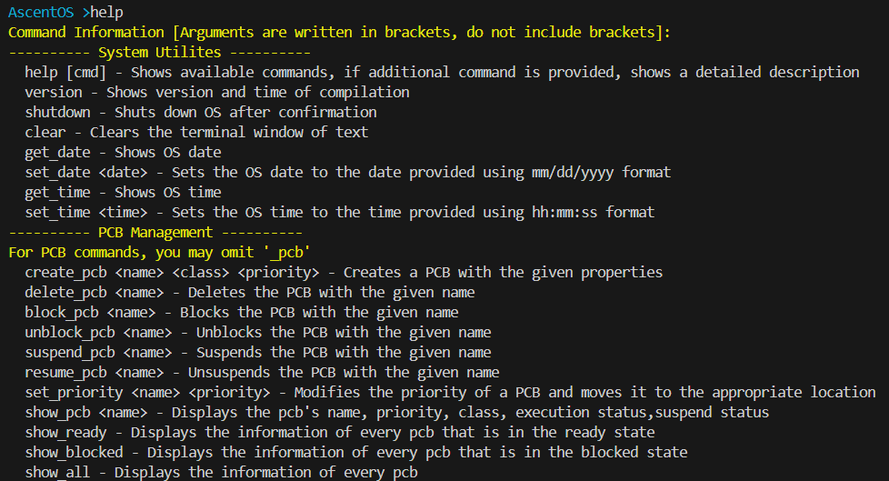

# AscentOS

AscentOS is our command line interface operating system project for CS_450: Operating Systems Structure at WVU. It is developed using Freestanding C, which means we do not have access to many standard C libraries. This file will provide a quick breakdown of the file structure, and the steps for running the OS for yourself after it has been cloned.

## Setup and Run
1. After installing the dependencies from the *Installing Dependencies* section, open WSL terminal in the Group-7 directory and type 'make clean' to delete the *.io files if there are any

2. Run 'make' to build the project.

3. Run './mpx.sh' to start the shell script.  

4. You should be ready to execute OS commands! Type 'help' to see a list of available commands!

## Installing Dependencies
## On a Windows OS
Execute the command from a terminal as an admin 'wsl --install -d ubuntu' This will install the Windows subsystem for linux. You may need to restart to be able to launch the Ubuntu window.
To use Ubuntu and other Debian serivces run in a terminal 'sudo apt updatesudo apt install -y clang make nasm git binutils-i686-linux-gnu qemu-system-x86 gdb'

## On a MAC OS
### Installing XCode Tools
From a MAC Shell execute the command 'xcode-select --install' which will install the XCode development tools
### Installing Homebrew
Next, install the Homebrew package manager from https://brew.sh. There should be a command under the label "Install Homebrew" that you can copy and paste into your Terminal window. Note that this makes use of the XCode tools installed in the first step, so that must be complete prior to this step. It is likely that installing Homebrew will prompt you for your password so that it can elevate privileges using sudo. This is the same password you use to unlock your account when you turn on your system.
### Installing Remaining Tools
Execute the following command to install the remaining tools 'brew install nasm qemu i686-elf-binutils i386-elf-gdb' Once Homebrew is installed, you can easily install NASM, QEMU, the cross-linker, and cross-debugger. If you get an error here, make sure that you followed the ==> Next steps: portion of the Homebrew installation process. You may need to open a new Terminal window for the changes to take effect.

## Path Guide
### /doc
Contains all docucmentation developed for our OS, including both our User and Programmer's Manuals, as well as some information about the mpx project template we were given.  

### /include
Contains all header files for any C files developed within the project. **/include/mpx** stores all headers partaining to the OS, while **/include** stores all headers that would come from a C library. 

### /kernel
Contains all kernel-level files, such as kmain. These files interact directly with the hardware. 

### /lib
Contains all C library-like files, such as string.c and stdlib.c. Any C library functions used by the project must be stored here.

### /make
Contains files to modify this projects configuration.

### /user
Contains all user-level files, such as commhand.c. These files interact with the user, and call kernel-level functions after ensuring safe and valid input. 

